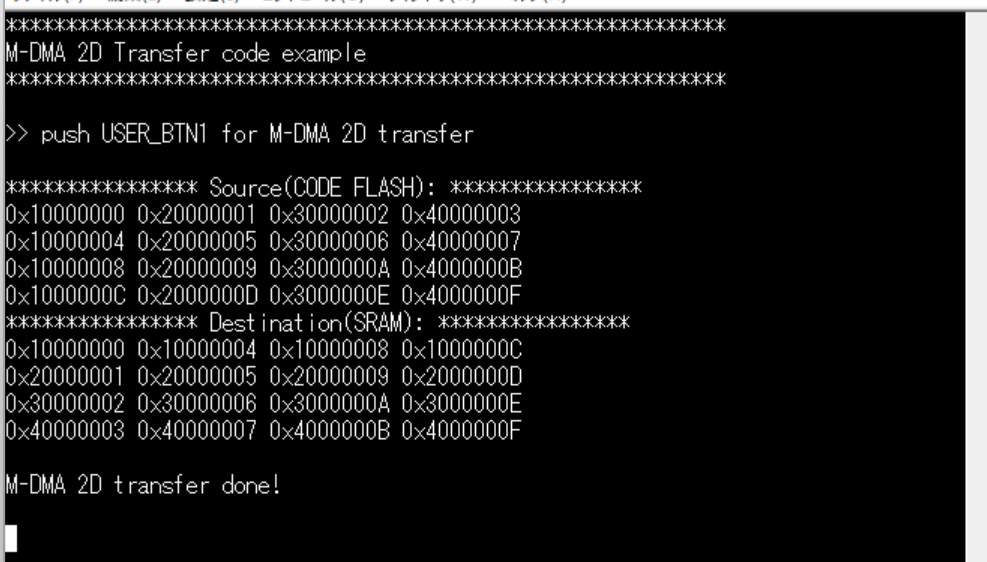
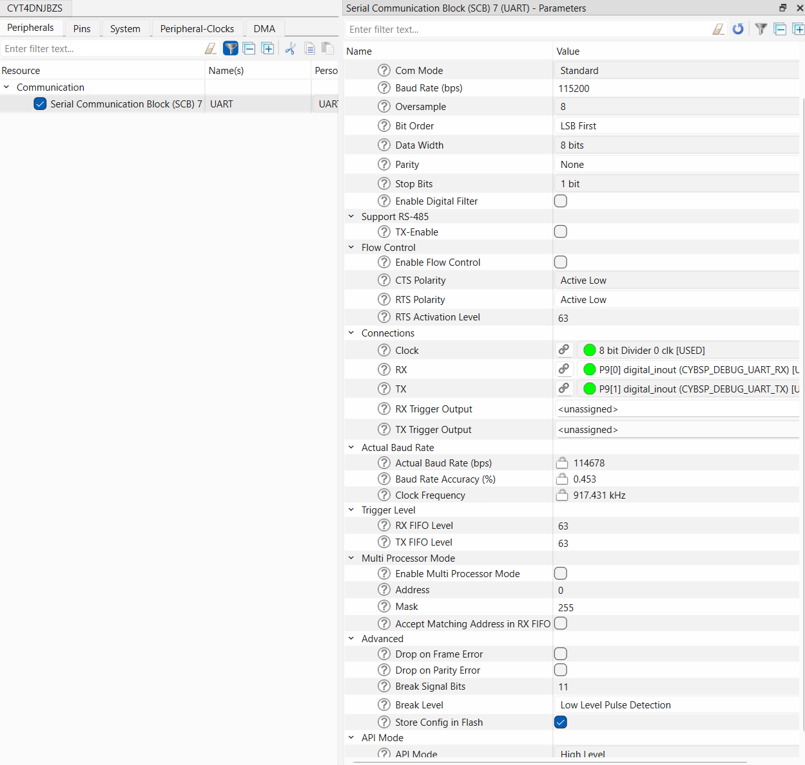
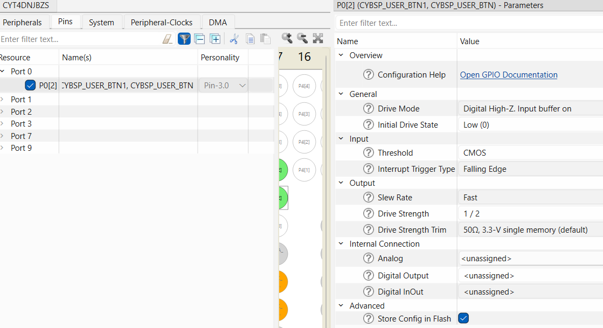
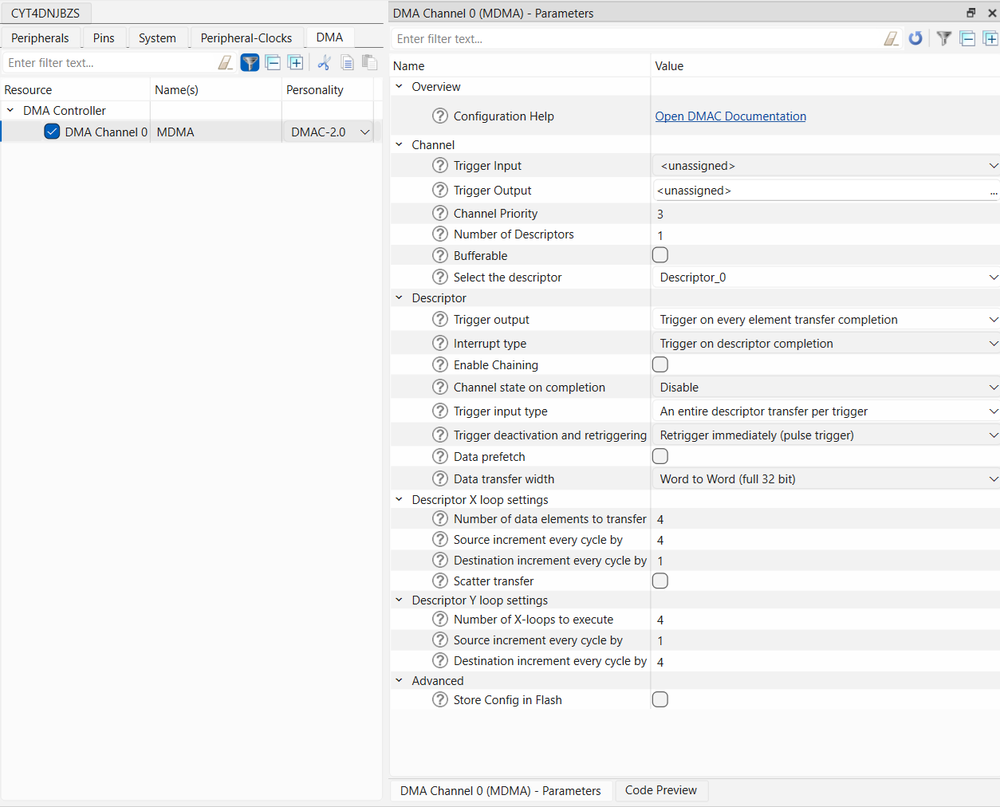

# TRAVEO&trade; T2G: M-DMA 2D transfer

This code example demonstrates the transmission of data using memory direct memory access DMA (M-DMA) 2D transfer, including its operation, initial setting, and interrupt handling.


[View this README on GitHub.](https://github.com/Infineon/mtb-example-ce241259-mdma-2d-transfer)

[Provide feedback on this code example.](https://yourvoice.infineon.com/jfe/form/SV_1NTns53sK2yiljn?Q_EED=eyJVbmlxdWUgRG9jIElkIjoiQ0UyNDEyNTkiLCJTcGVjIE51bWJlciI6IjAwMi00MTI1OSIsIkRvYyBUaXRsZSI6IlRSQVZFTyZ0cmFkZTsgVDJHOiBNLURNQSAyRCB0cmFuc2ZlciIsInJpZCI6Im1hc2FoaWRlLmthcmlub0BpbmZpbmVvbi5jb20iLCJEb2MgdmVyc2lvbiI6IjEuMS4wIiwiRG9jIExhbmd1YWdlIjoiRW5nbGlzaCIsIkRvYyBEaXZpc2lvbiI6Ik1DRCIsIkRvYyBCVSI6IkFVVE8iLCJEb2MgRmFtaWx5IjoiQVVUTyBNQ1UifQ==)


## Requirements

- [ModusToolbox&trade;](https://www.infineon.com/modustoolbox) v3.6 or later (tested with v3.6)
- Board support package (BSP) minimum required version: 3.0.0
- Programming language: C
- Associated parts: [TRAVEO&trade; T2G family Cluster series](https://www.infineon.com/cms/en/product/microcontroller/32-bit-traveo-t2g-arm-cortex-microcontroller/32-bit-traveo-t2g-arm-cortex-for-cluster/), [TRAVEO&trade; T2G family body high CYT4BF series](https://www.infineon.com/products/microcontroller/32-bit-traveo-t2g-arm-cortex/for-body/t2g-cyt4bf)


## Supported toolchains (make variable 'TOOLCHAIN')

- GNU Arm&reg; Embedded Compiler v14.2.1 (`GCC_ARM`) – Default value of `TOOLCHAIN`
- Arm&reg; Compiler v6.22 (`ARM`)
- IAR C/C++ Compiler v9.50.2 (`IAR`)


## Supported kits (make variable 'TARGET')

- [TRAVEO&trade; T2G Cluster 6M Lite Kit](https://www.infineon.com/cms/en/product/evaluation-boards/kit_t2g_c-2d-6m_lite/) (`KIT_T2G_C-2D-6M_LITE`) – Default value of `TARGET`
- [TRAVEO&trade; T2G Cluster 4M Lite Kit](https://www.infineon.com/evaluation-board/KIT-T2G-C-2D-4M-LITE) (`KIT_T2G_C-2D-4M_LITE`)<br>
- [TRAVEO&trade; T2G Body high Lite Kit](https://www.infineon.com/evaluation-board/KIT-T2G-B-H-LITE) (`KIT_T2G-B-H_LITE`)
- [TRAVEO&trade; T2G Body high Evaluation Kit](https://www.infineon.com/evaluation-board/KIT-T2G-B-H-EVK) (`KIT_T2G-B-H_EVK`)


## Hardware setup

This example uses the board's default configuration. See the kit user guide to ensure that the board is configured correctly.


## Software setup

See the [ModusToolbox&trade; tools package installation guide](https://www.infineon.com/ModusToolboxInstallguide) for information about installing and configuring the tools package.

Install a terminal emulator if you do not have one. Instructions in this document use [Tera Term](https://teratermproject.github.io/index-en.html).

This example requires no additional software or tools.


## Using the code example


### Create the project

The ModusToolbox&trade; tools package provides the Project Creator as both a GUI tool and a command line tool.

<details><summary><b>Use Project Creator GUI</b></summary>

1. Open the Project Creator GUI tool

   There are several ways to do this, including launching it from the dashboard or from inside the Eclipse IDE. For more details, see the [Project Creator user guide](https://www.infineon.com/ModusToolboxProjectCreator) (locally available at *{ModusToolbox&trade; install directory}/tools_{version}/project-creator/docs/project-creator.pdf*)

2. On the **Choose Board Support Package (BSP)** page, select a kit supported by this code example. See [Supported kits](#supported-kits-make-variable-target)

   > **Note:** To use this code example for a kit not listed here, you may need to update the source files. If the kit does not have the required resources, the application may not work

3. On the **Select Application** page:

   a. Select the **Applications(s) Root Path** and the **Target IDE**

      > **Note:** Depending on how you open the Project Creator tool, these fields may be pre-selected for you

   b. Select this code example from the list by enabling its check box

      > **Note:** You can narrow the list of displayed examples by typing in the filter box

   c. (Optional) Change the suggested **New Application Name** and **New BSP Name**

   d. Click **Create** to complete the application creation process

</details>


<details><summary><b>Use Project Creator CLI</b></summary>

The 'project-creator-cli' tool can be used to create applications from a CLI terminal or from within batch files or shell scripts. This tool is available in the *{ModusToolbox&trade; install directory}/tools_{version}/project-creator/* directory.

Use a CLI terminal to invoke the 'project-creator-cli' tool. On Windows, use the command-line 'modus-shell' program provided in the ModusToolbox&trade; installation instead of a standard Windows command-line application. This shell provides access to all ModusToolbox&trade; tools. You can access it by typing "modus-shell" in the search box in the Windows menu. In Linux and macOS, you can use any terminal application.

The following example clones the "[mtb-example-ce241259-mdma-2d-transfer](https://github.com/Infineon/mtb-example-ce241259-mdma-2d-transfer)" application with the desired name "Mdma2dtransfer" configured for the *KIT_T2G_C-2D-6M_LITE* BSP into the specified working directory, *C:/mtb_projects*:

   ```
   project-creator-cli --board-id KIT_T2G_C-2D-6M_LITE --app-id mtb-example-ce241259-mdma-2d-transfer --user-app-name Mdma2dtransfer --target-dir "C:/mtb_projects"
   ```

The 'project-creator-cli' tool has the following arguments:

Argument | Description | Required/optional
---------|-------------|-----------
`--board-id` | Defined in the <id> field of the [BSP](https://github.com/Infineon?q=bsp-manifest&type=&language=&sort=) manifest | Required
`--app-id`   | Defined in the <id> field of the [CE](https://github.com/Infineon?q=ce-manifest&type=&language=&sort=) manifest | Required
`--target-dir`| Specify the directory in which the application is to be created if you prefer not to use the default current working directory | Optional
`--user-app-name`| Specify the name of the application if you prefer to have a name other than the example's default name | Optional

<br>

> **Note:** The project-creator-cli tool uses the `git clone` and `make getlibs` commands to fetch the repository and import the required libraries. For details, see the "Project creator tools" section of the [ModusToolbox&trade; tools package user guide](https://www.infineon.com/ModusToolboxUserGuide) (locally available at {ModusToolbox&trade; install directory}/docs_{version}/mtb_user_guide.pdf).

</details>


### Open the project

After the project has been created, you can open it in your preferred development environment.


<details><summary><b>Eclipse IDE</b></summary>

If you opened the Project Creator tool from the included Eclipse IDE, the project will open in Eclipse automatically.

For more details, see the [Eclipse IDE for ModusToolbox&trade; user guide](https://www.infineon.com/MTBEclipseIDEUserGuide) (locally available at *{ModusToolbox&trade; install directory}/docs_{version}/mt_ide_user_guide.pdf*).

</details>


<details><summary><b>Visual Studio (VS) Code</b></summary>

Launch VS Code manually, and then open the generated *{project-name}.code-workspace* file located in the project directory.

For more details, see the [Visual Studio Code for ModusToolbox&trade; user guide](https://www.infineon.com/MTBVSCodeUserGuide) (locally available at *{ModusToolbox&trade; install directory}/docs_{version}/mt_vscode_user_guide.pdf*).

</details>


<details><summary><b>Arm&reg; Keil&reg; µVision&reg;</b></summary>

Double-click the generated *{project-name}.cprj* file to launch the Keil&reg; µVision&reg; IDE.

For more details, see the [Arm&reg; Keil&reg; µVision&reg; for ModusToolbox&trade; user guide](https://www.infineon.com/MTBuVisionUserGuide) (locally available at *{ModusToolbox&trade; install directory}/docs_{version}/mt_uvision_user_guide.pdf*).

</details>


<details><summary><b>IAR Embedded Workbench</b></summary>

Open IAR Embedded Workbench manually, and create a new project. Then select the generated *{project-name}.ipcf* file located in the project directory.

For more details, see the [IAR Embedded Workbench for ModusToolbox&trade; user guide](https://www.infineon.com/MTBIARUserGuide) (locally available at *{ModusToolbox&trade; install directory}/docs_{version}/mt_iar_user_guide.pdf*).

</details>


<details><summary><b>Command line</b></summary>

If you prefer to use the CLI, open the appropriate terminal, and navigate to the project directory. On Windows, use the command-line 'modus-shell' program; on Linux and macOS, you can use any terminal application. From there, you can run various `make` commands.

For more details, see the [ModusToolbox&trade; tools package user guide](https://www.infineon.com/ModusToolboxUserGuide) (locally available at *{ModusToolbox&trade; install directory}/docs_{version}/mtb_user_guide.pdf*).

</details>


## Operation

1. Connect the board to your PC using the provided USB cable through the KitProg3 USB connector

2. Open a terminal program and select the KitProg3 COM port. Set the serial port parameters to 8N1 and 115200 baud

3. Program the board using one of the following:

   <details><summary><b>Using Eclipse IDE</b></summary>

      1. Select the application project in the Project Explorer

      2. In the **Quick Panel**, scroll down, and click **\<Application Name> Program (KitProg3_MiniProg4)**
   </details>


   <details><summary><b>In other IDEs</b></summary>

   Follow the instructions in your preferred IDE

   </details>


   <details><summary><b>Using CLI</b></summary>

     From the terminal, execute the `make program` command to build and program the application using the default toolchain to the default target. The default toolchain is specified in the application's Makefile but you can override this value manually:
      ```
      make program TOOLCHAIN=<toolchain>
      ```

      Example:
      ```
      make program TOOLCHAIN=GCC_ARM
      ```
   </details>

4. After programming, the application starts automatically. Press user button 1 (USER_BTN1) to transfer data. Confirm the following messages are displayed on the UART terminal

   **Figure 1. Terminal output on program startup**

   


## Debugging

You can debug the example to step through the code.


<details><summary><b>In Eclipse IDE</b></summary>

Use the **\<Application Name> Debug (KitProg3_MiniProg4)** configuration in the **Quick Panel**. For details, see the "Program and debug" section in the [Eclipse IDE for ModusToolbox&trade; user guide](https://www.infineon.com/MTBEclipseIDEUserGuide).


</details>


<details><summary><b>In other IDEs</b></summary>

Follow the instructions in your preferred IDE.

</details>


## Design and implementation

This design consists of M-DMA and USER_BTN1. M-DMA is set to initiate transfers by software triggers. Pressing USER_BTN1 generates an interrupt. When an interrupt occurs, M-DMA transfer is triggered by software. Then, M-DMA transfers data from a source address to a destination address through 2D transfer.

The transmitted data is composed of 32 bytes on code flash memory and transferred to the UART TX FIFO using 2D transfer in the descriptor. The terminal software connected to the KitProg3 COM port prints out the data transferred. 

This 2D transfer is configured to perform X-loop four times and Y-loop four times on each trigger. 

### STDOUT

At each step, the current information is printed onto the UART and can be read via the terminal program.

The [`cy_retarget_io_init()`](https://infineon.github.io/retarget-io/html/group__group__board__libs.html#ga4905a76eaea9b40111887f5b6ff7d252) function performs the initialization of the GPIO for UART:

- Initializes the pin specified by CYBSP_DEBUG_UART_TX as UART TX and the pin specified by CYBSP_DEBUG_UART_RX as UART RX (these pins are connected to the KitProg3 COM port)
- The serial port parameters are 8N1 and 115200 baud

In KIT_T2G_C-2D-6M_LITE, serial communications block (SCB) 7 is used to communicate with the terminal software.

**Figure 1** shows SCB7 configuration in the device configurator.

**Figure 1. Device configurator for SCB**




### GPIO port pin initialization

To initiate a 2D transfer, a GPIO interrupt from USER_BTN1 is used. The interrupt is triggered on the falling edge of the button signal.

**Figure 2** shows GPIO configuration in device configurator.

**Figure 2. Device configurator for GPIO**



The GPIO port pin is initialized using `cybsp_init()`.

The GPIO interrupt is configured once.

- Register a interrupt handler for USER_BTN1 by [`Cy_SysInt_Init()`](https://infineon.github.io/mtb-pdl-cat1/pdl_api_reference_manual/html/group__group__sysint__functions.html#gab2ff6820a898e9af3f780000054eea5d) function.


### M-DMA

The device configurator is used to configure M-DMA. This code example uses DMA channel 0 of the DMA controller and is referred to as MDMA.

This configuration is to perform X-loop four times and Y-loop four times on one trigger. The "Number of data elements to transfer" in the "Descriptor X loop settings" and The "Number of X-loops to execute" in the "Descriptor Y loop settings" are set to four. 

These settings enable a 2D transfer configuration.

**Figure 3** shows M-DMA configuration in device configurator.

**Figure 3. Device configurator for M-DMA**



1. To disable M-DMA and channel, [`Cy_DMAC_Disable()`](https://infineon.github.io/mtb-pdl-cat1/pdl_api_reference_manual/html/group__group__dmac__block__functions.html#ga326f150b8c5856c36bf2f19672c03a71") and [`Cy_DMAC_Channel_DeInit()`](https://infineon.github.io/mtb-pdl-cat1/pdl_api_reference_manual/html/group__group__dmac__channel__functions.html#gaac669d8281a624e28c436e7ff8588ac3) are called

2. Source and destination addresses are specified as  *DMAC_Descriptor_0_config.srcAddress* and *DMAC_Descriptor_0_config.dstAddress* 

3. To initialize the DMA descriptor, [`Cy_DMAC_Descriptor_Init()`](https://infineon.github.io/mtb-pdl-cat1/pdl_api_reference_manual/html/group__group__dmac__descriptor__functions.html#gad4204ef079b02d9afdd9328f0cd461f9) is called using [`cy_stc_dmac_descriptor_config_t`](https://infineon.github.io/mtb-pdl-cat1/pdl_api_reference_manual/html/structcy__stc__dmac__descriptor__config__t.html) and [`cy_stc_dmac_descriptor_t`](https://infineon.github.io/mtb-pdl-cat1/pdl_api_reference_manual/html/structcy__stc__dmac__descriptor__t.html) structures, which are auto-coded by device configurator as arguments

4. To initialize the DMA channel, [`Cy_DMAC_Channel_Init()`](https://infineon.github.io/mtb-pdl-cat1/pdl_api_reference_manual/html/group__group__dmac__channel__functions.html#ga7b508e6cc332b4d009bf9b09ed6529b3) is called using the [`cy_stc_dmac_channel_config_t`](https://infineon.github.io/mtb-pdl-cat1/pdl_api_reference_manual/html/structcy__stc__dmac__channel__config__t.html) structure, which is auto-coded by device configurator as an argument

> **Note:** This code example needs to set the source and destination addresses. Therefore, the **Store Config in Flash** checkbox in **Advanced** are not set.

The M-DMA interrupt is only configured once.

1. To set a priority for the M-DMA channel, [`Cy_DMAC_Channel_SetPriority()`](https://infineon.github.io/mtb-pdl-cat1/pdl_api_reference_manual/html/group__group__dmac__channel__functions.html#ga4e68ab04d5de2d6a1b31779741aa64db) is called, and the interrupt is enabled by [`Cy_DMAC_Channel_SetInterruptMask()`](https://infineon.github.io/mtb-pdl-cat1/pdl_api_reference_manual/html/group__group__dmac__channel__functions.html#gae0485c56ffe98283f8b9326ee6d516ae)

2. To enable M-DMA, [`Cy_DMAC_Enable()`](https://infineon.github.io/mtb-pdl-cat1/pdl_api_reference_manual/html/group__group__dmac__block__functions.html#ga3f45f389340c3282c59d6ffe6e5040b5) is called

3. A handler for the M-DMA channel is registered using [`Cy_SysInt_Init()`](https://infineon.github.io/mtb-pdl-cat1/pdl_api_reference_manual/html/group__group__sysint__functions.html#gab2ff6820a898e9af3f780000054eea5d)

4. To enable IRQ, `NVIC_EnableIRQ()` is called 


#### M-DMA transfer

1. When USER_BTN1 press is detected, the `HandleGPIOIntr()` is called, which sets `g_isInterrupt`

2. The application detects `g_isInterrupt` and calls [`Cy_DMAC_Channel_SetDescriptor()`](https://infineon.github.io/mtb-pdl-cat1/pdl_api_reference_manual/html/group__group__dmac__channel__functions.html#ga0ea7589df07e40e6723dc7f992e6994b) using the [`cy_stc_dmac_descriptor_t`](https://infineon.github.io/mtb-pdl-cat1/pdl_api_reference_manual/html/structcy__stc__dmac__descriptor__t.html) structure, which is auto-coded by the  device configurator as an argument to set a descriptor as current for the specified M-DMA channel

3. The M-DMA channel is enabled by [`Cy_DMAC_Channel_Enable()`](https://infineon.github.io/mtb-pdl-cat1/pdl_api_reference_manual/html/group__group__dmac__channel__functions.html#gab39e11c3ad72ebfd07cdd9840385769b) and an M-DMA transfer is initiated by [`Cy_TrigMux_SwTrigger()`](https://infineon.github.io/mtb-pdl-cat1/pdl_api_reference_manual/html/group__group__trigmux.html#ga882218319ecd105dede8b382e9a1c4a4)

4. `HandleDMACIntr()` is called by DMA transfer completion, which sets `g_isComplete`

5. The application detects `g_isComplete` and calls `memcmp()` to verify that the destination data matches the source

#### ISR for DMA transfer completion

The ISR function for completing the DMA transfer is `HandleDMACIntr()`:

1. It checks if the intended interrupt has occurred by calling [`Cy_DMAC_Channel_GetInterruptStatusMasked()`](https://infineon.github.io/mtb-pdl-cat1/pdl_api_reference_manual/html/group__group__dmac__channel__functions.html#ga586bd262ab7725b4588dde9516c88b1e) before starting the ISR process

2. It sets `g_isComplete` after clearing the interrupt by calling [`Cy_DMAC_Channel_ClearInterrupt()`](https://infineon.github.io/mtb-pdl-cat1/pdl_api_reference_manual/html/group__group__dmac__channel__functions.html#ga31fbd71a93ff4332b8e8df56090f9423)


#### Trigger DMA via software

To start the DMA transfer via software, use the **Trigger Multiplexer (TrigMUX)** to generate a software trigger. In the PDL, this is done with the [`Cy_TrigMux_SwTrigger()`](https://infineon.github.io/mtb-pdl-cat1/pdl_api_reference_manual/html/group__group__trigmux.html#ga882218319ecd105dede8b382e9a1c4a4) function. See the device datasheet for the trigger line corresponding to the used DMA channel.


### Resources and settings

**Table 1. Application resources**

 Resource  |  Alias/object             |    Purpose
 :-------- | :-------------            | :------------
 M-DMA     | MDMA                      | M-DMA to transfer data
 UART      | `cy_retarget_io_uart_obj` | UART object used by Retarget-IO for the Debug UART port
 GPIO      | CYBSP_USER_BTN            | User button

<br>


## Related resources

Resources  | Links
-----------|----------------------------------
Application notes  | [AN235305](https://www.infineon.com/assets/row/public/documents/10/42/infineon-an235305-getting-started-with-traveo-t2g-family-mcus-in-modustoolbox-applicationnotes-en.pdf) – Getting started with TRAVEO&trade; T2G family MCUs in ModusToolbox&trade; <br> [AN220191](https://www.infineon.com/assets/row/public/documents/10/42/infineon-an220191---how-to-use-direct-memory-access-dma-controller-in-traveot2g-family-applicationnotes-en.pdf) – How to use direct memory access (DMA) controller in TRAVEO&trade; T2G family
Code examples  | [Using ModusToolbox&trade;](https://github.com/Infineon/Code-Examples-for-ModusToolbox-Software) on GitHub
Device documentation | [TRAVEO&trade; T2G body high family MCUs datasheets](https://www.infineon.com/products/microcontroller/32-bit-traveo-t2g-arm-cortex/for-body/t2g-cyt4bf/#documents) <br> [TRAVEO&trade; T2G body high family MCUs architecture/registers reference manuals](https://www.infineon.com/products/microcontroller/32-bit-traveo-t2g-arm-cortex/for-body/t2g-cyt4bf/#documents) <br> [TRAVEO&trade; T2G cluster family MCUs datasheets for CYT4DN](https://www.infineon.com/products/microcontroller/32-bit-traveo-t2g-arm-cortex/for-cluster/#documents) <br> [TRAVEO&trade; T2G cluster family MCUs architecture/registers reference manuals for CYT4DN](https://www.infineon.com/products/microcontroller/32-bit-traveo-t2g-arm-cortex/for-cluster/#documents) <br> [TRAVEO&trade; T2G cluster family MCUs datasheets for CYT3DL](https://www.infineon.com/products/microcontroller/32-bit-traveo-t2g-arm-cortex/for-cluster/#documents) <br> [TRAVEO&trade; T2G cluster family MCUs architecture/registers reference manuals for CYT3DL](https://www.infineon.com/products/microcontroller/32-bit-traveo-t2g-arm-cortex/for-cluster/#documents)　<br>
Development kits | Select your kits from the [Evaluation board finder](https://www.infineon.com/cms/en/design-support/finder-selection-tools/product-finder/evaluation-board)
Libraries on GitHub  | [mtb-pdl-cat1](https://github.com/Infineon/mtb-pdl-cat1) – Peripheral Driver Library (PDL) <br> [retarget-io](https://github.com/Infineon/retarget-io) – Utility library to retarget STDIO messages to a UART port　
Tools  | [ModusToolbox&trade;](https://www.infineon.com/modustoolbox) – ModusToolbox&trade; software is a collection of easy-to-use libraries and tools enabling rapid development with Infineon MCUs for applications ranging from wireless and cloud-connected systems, edge AI/ML, embedded sense and control, to wired USB connectivity using PSOC&trade; Industrial/IoT MCUs, AIROC&trade; Wi-Fi and Bluetooth&reg; connectivity devices, XMC&trade; Industrial MCUs, and EZ-USB&trade;/EZ-PD&trade; wired connectivity controllers. ModusToolbox&trade; incorporates a comprehensive set of BSPs, HAL, libraries, configuration tools, and provides support for industry-standard IDEs to fast-track your embedded application development

<br>


## Other resources

Infineon provides a wealth of data at [www.infineon.com](https://www.infineon.com) to help you select the right device, and quickly and effectively integrate it into your design.


## Document history

Document title: *CE241259* – *TRAVEO&trade; T2G: M-DMA 2D transfer* 

 Version | Description of change
 ------- | ---------------------
 1.0.0   | New code example
 1.1.0   | Added support for KIT_T2G_C-2D-4M_LITE, KIT_T2G-B-H_EVK and KIT_T2G-B-H_LITE and updated to support ModusToolbox&trade; v3.6
<br>


All referenced product or service names and trademarks are the property of their respective owners.

The Bluetooth&reg; word mark and logos are registered trademarks owned by Bluetooth SIG, Inc., and any use of such marks by Infineon is under license.

PSOC&trade;, formerly known as PSoC&trade;, is a trademark of Infineon Technologies. Any references to PSoC&trade; in this document or others shall be deemed to refer to PSOC&trade;.

---------------------------------------------------------

(c) 2025-2026, Infineon Technologies AG, or an affiliate of Infineon Technologies AG. All rights reserved.
This software, associated documentation and materials ("Software") is owned by Infineon Technologies AG or one of its affiliates ("Infineon") and is protected by and subject to worldwide patent protection, worldwide copyright laws, and international treaty provisions. Therefore, you may use this Software only as provided in the license agreement accompanying the software package from which you obtained this Software. If no license agreement applies, then any use, reproduction, modification, translation, or compilation of this Software is prohibited without the express written permission of Infineon.
<br>
Disclaimer: UNLESS OTHERWISE EXPRESSLY AGREED WITH INFINEON, THIS SOFTWARE IS PROVIDED AS-IS, WITH NO WARRANTY OF ANY KIND, EXPRESS OR IMPLIED, INCLUDING, BUT NOT LIMITED TO, ALL WARRANTIES OF NON-INFRINGEMENT OF THIRD-PARTY RIGHTS AND IMPLIED WARRANTIES SUCH AS WARRANTIES OF FITNESS FOR A SPECIFIC USE/PURPOSE OR MERCHANTABILITY. Infineon reserves the right to make changes to the Software without notice. You are responsible for properly designing, programming, and testing the functionality and safety of your intended application of the Software, as well as complying with any legal requirements related to its use. Infineon does not guarantee that the Software will be free from intrusion, data theft or loss, or other breaches (“Security Breaches”), and Infineon shall have no liability arising out of any Security Breaches. Unless otherwise explicitly approved by Infineon, the Software may not be used in any application where a failure of the Product or any consequences of the use thereof can reasonably be expected to result in personal injury.
